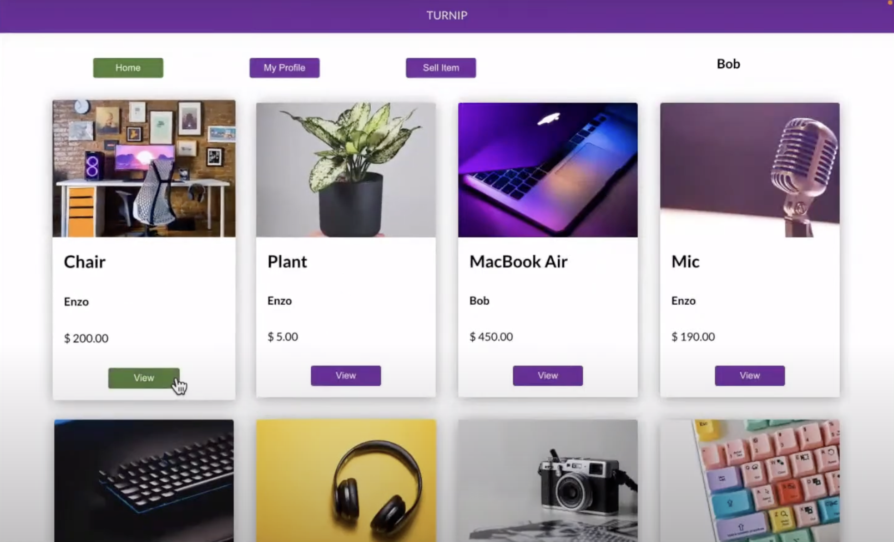

## Hi there, I'm Ravi 👋

**I'm a software engineer passionate about frontend development and understanding the user experience.**

- 📖 I'm reading [Inspired by Marty Cagan](https://www.amazon.ca/INSPIRED-Create-Tech-Products-Customers/dp/1119387507), which is great book on product management.
- 📫 How to reach me: jadeleafmoon@gmail.com
- ⚡ Fun fact: I love playing challenging acoustic guitar songs 🎸

## Tech Skills 💻

- **Languages:** JavaScript, HTML, CSS
- **Frontend**: React, React Native, Vue 3
- **Backend:** Node, Express, PostgreSQL, Knex
- **Additional Tools:** Git, GitHub, Firebase, Bootstrap, Mocha, Chai, TDD, Heroku, Railway, Expo App Store, Agile

Though it's been a while, I also have experience with Vue, GraphQL, Ruby, and Ruby on Rails.

## Take a Look 📺

**[Gradiance](https://gradiance.ca) - _Frontend Developer & Product Owner_ -** [gradiance.ca](https://gradiance.ca) 💻 [Code](https://github.com/jadeleafmoon/gradiance)

A colorful and relaxing puzzle game.

Tech Stack: Vue 3, JavaScript, HTML, and CSS.

    

 

**[Runtomo](https://youtu.be/ijyDfnP7na8) - _Frontend Developer & UX Lead_** - 📺 [Video Demo](https://youtu.be/ijyDfnP7na8) 💻 [Code](https://github.com/CCP4-senior/runtomo-frontend)

Runtomo is a mobile app for runners to find running buddies and create events. We wanted to make running more fun and social where people can explore new parts of their neighborhood and find great running paths. 🏃‍♀️

Tech Stack: React Native, React Native Paper, JavaScript, HTML, CSS, and Firebase.

    

 

**[Turnip](https://www.youtube.com/live/jLNM3GcS53U?feature=share&t=975) - _Full-Stack Developer & Product Owner_** - 📺 [Video Demo](https://www.youtube.com/live/jLNM3GcS53U?feature=share&t=975) 💻 [Code](https://github.com/jadeleafmoon/turnip-app)

Turnip is a web app I built that allows users to buy and sell their used items. I was disappointed with the current offerings of marketplaces, so I created my own with a more modern and user-friendly design.

Tech Stack: React, JavaScript, Node, Express, Knex, PostgreSQL, HTML, CSS, and Firebase.

    

## Blog Posts 🖊️
- [The Power of Pair Programming: How I Leveled Up My Communication Skills](https://www.codechrysalis.io/alumni-blog/the-power-of-pair-programming-how-i-leveled-up-my-communication-skills)
- [My Favorite Resources on Studying Data Structures, Algorithms, and Patterns](https://github.com/jadeleafmoon/blog/blob/main/algorithms.md)

## Let's Connect 👋
- jadeleafmoon@gmail.com
- [LinkedIn](https://www.linkedin.com/in/ravikalsi/)
- [YouTube](https://www.youtube.com/watch?v=ijyDfnP7na8) 
